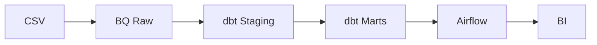
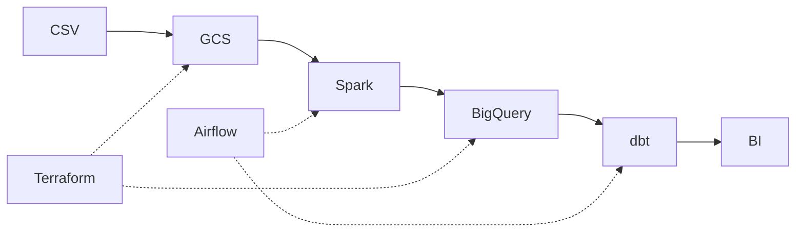
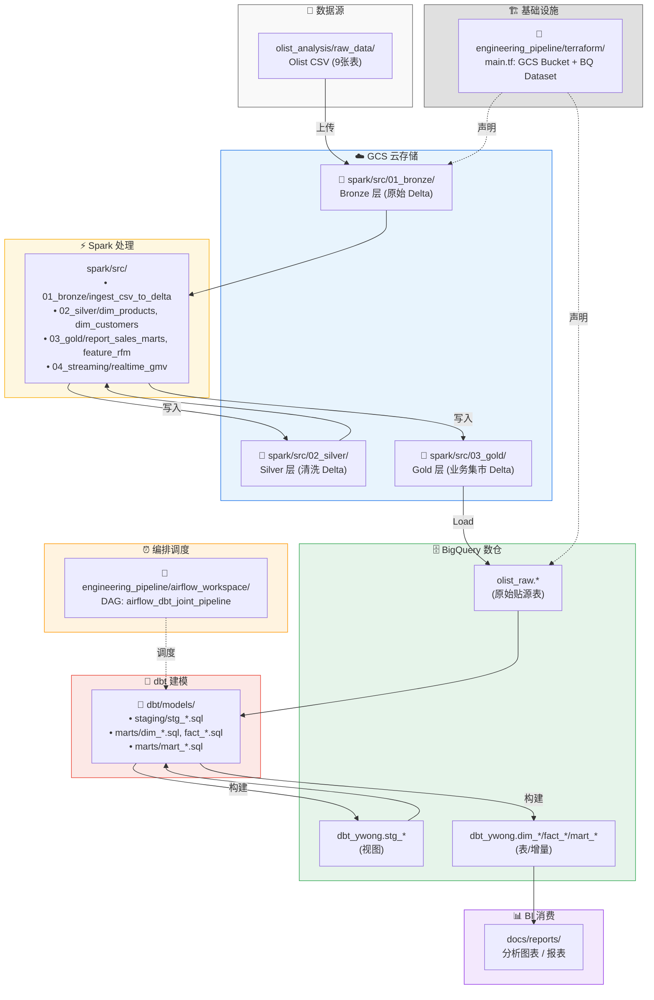
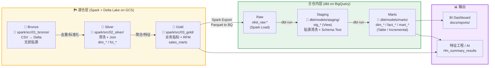
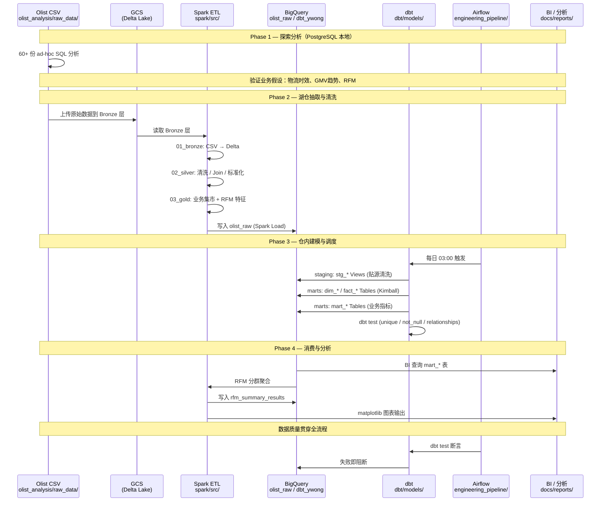

# Modern E-commerce Data Platform

基于 [Olist 巴西电商公开数据集](https://www.kaggle.com/datasets/olistbr/brazilian-ecommerce) 构建的现代数据平台。项目采用 **Discovery → Production** 演进路径：先在本地完成深度业务探索，再将高价值分析沉淀为可调度、可测试的云上指标层。

**目标架构：** `GCS → Spark → BigQuery → dbt → BI`

---

## 学习路径

本项目按时间顺序递进，每个阶段建立在前一阶段的基础上，最终收敛为 `GCS → Spark → BigQuery → dbt → Airflow → BI` 的完整数据平台链路。


### Phase 1: SQL 语法基础

| 做了什么 | 学到的知识点 |
|---|---|
| 完成 LeetCode SQL 50 精选题目（40+ 道），涵盖连续数字判断、登录间隔计算、员工层级查询、月度交易统计等场景，解题记录保存至 `leetcode_sql/` | 窗口函数（`ROW_NUMBER` / `DENSE_RANK` / `LAG`）、自连接、子查询、`DATEDIFF`、`CASE WHEN`、`GROUP BY` + `HAVING`、公共表表达式 |

### Phase 2: PostgreSQL 本地探索分析

| 做了什么 | 学到的知识点 |
|---|---|
| 在 PostgreSQL 中建表、导入 Olist 9 张 CSV，编写 DDL 脚本和清洗逻辑，产出 35+ 份探索性分析 SQL，覆盖 RFM 指标统计、7 日移动平均、物流各节点时效分布、用户复购间隔、城市维度 GMV 排名、首单 vs 复购金额对比 | PostgreSQL DDL/DML、维度建模初步（RFM 模型）、窗口函数实战（滑动平均）、时间序列分析、业务指标体系设计 |

### Phase 3: Python ETL 框架

| 做了什么 | 学到的知识点 |
|---|---|
| 设计通用 ETL 引擎 `etl/core/engine.py`（Extract → Transform → Load 三步控制器），编写配套工具库（`db.py` 数据库连接管理、`data_cleaner.py` 数据清洗、`data_quality.py` 质量检查、`file_handler.py` 文件处理），实现 3 个加载脚本将 Olist 数据写入 PostgreSQL | ETL 管道设计模式、Pandas DataFrame 操作、SQLAlchemy 连接管理、模块化代码组织、错误处理与异常捕获 |

### Phase 4: GCS + BigQuery 云数据栈

| 做了什么 | 学到的知识点 |
|---|---|
| 使用 Terraform 声明式创建 GCS 存储桶（`olist-spark-staging-yuto-2026`）和 BigQuery 数据集（`dbt_ywong_terraform`），配置安全策略（禁止公共访问、统一 IAM 权限），编写 BQ 加载日志查询脚本 | Terraform HCL 语法（`resource` / `output` 声明）、GCP 资源生命周期管理（`force_destroy` / `delete_contents_on_destroy`）、云存储权限模型、BigQuery 分区与加载监控 |

### Phase 5: dbt 数据建模与工程化

| 做了什么 | 学到的知识点 |
|---|---|
| 构建 8 个 staging 视图（贴源清洗、类型标准化、异常过滤）、5 个维度表（含 RFM 分群的 `dim_customers`）、2 个事实表（订单/行项目粒度）、5 个业务 Mart（日 GMV 趋势/物流时效/用户行为/复购率/城市排名）、编写 2 个 dbt test 断言；将 Phase 2 探索分析中的高价值 SQL 工程化为可调度、可测试的数据模型 | dbt 项目结构（models/staging/marts）、Kimball 星型模型设计、Jinja 模板与 `ref`/`source` 宏、增量模型与快照、dbt test（`unique`/`not_null`/`relationships`/`accepted_values`）、数据血缘追踪 |

### Phase 6: Apache Spark 分布式处理

| 做了什么 | 学到的知识点 |
|---|---|
| 实现 Medallion 架构——Bronze 层（CSV → Delta Lake，Notebook 方式摄入）、Silver 层（清洗/Join/标准化，生成维度与事实表）、Gold 层（业务集市聚合 + RFM 特征工程）、Streaming 层（实时 GMV 监控实验） | Spark DataFrame API、Delta Lake 时间旅行与 ACID 事务、Medallion（Bronze/Silver/Gold）分层架构、流批一体（Structured Streaming）、Databricks Notebook 开发 |

### Phase 7: Airflow 工作流编排与整合

| 做了什么 | 学到的知识点 |
|---|---|
| 编写 DAG `airflow_dbt_joint_pipeline`，编排任务链 `dbt debug → dbt deps → dbt run → dbt test`，配置每日 03:00 定时调度，实现幂等性（`{{ ds }}` 锁死分区），编写学习过程 DAG（首次 BQ 查询、幂等规范、邮件告警），通过 Docker Compose 容器化部署 Airflow | Airflow DAG 设计与调度策略（cron/retry）、BashOperator 与任务依赖、XCom 数据传递、幂等性设计原则、Docker Compose 多服务编排 |

> **设计哲学：** Phase 1 的 ad-hoc 分析验证业务假设；Phase 5 将有复用价值的指标工程化为 dbt Mart；Phase 3、6、7 补齐编排与大规模处理能力。

---

## 架构图

### 当前 Demo 主链路（可运行）

```
Olist CSV ──上传──▶ BigQuery (olist_raw)
                         │
                    dbt staging (stg_* 视图)
                         │
                    dbt marts (dim_* / fact_* / mart_*)
                         │
              Airflow 每日调度 + dbt test
                         │
                    BI / 报表（待接入）
```



### 目标全链路（Roadmap）



### 分层职责


| 层级   | 技术               | 存储             | 职责                              |
| ------ | ------------------ | ---------------- | --------------------------------- |
| 湖仓层 | Spark + Delta Lake | GCS / Databricks | 大规模清洗、Join、流式处理        |
| 仓内层 | dbt                | BigQuery         | SQL 维度建模、增量刷新、质量测试  |
| 编排层 | Airflow            | —               | 定时调度、失败重试、任务依赖      |
| 基建层 | Terraform          | GCP              | GCS Bucket、BQ Dataset 声明式管理 |

**dbt 不属于湖仓层。** Spark 将数据 Load 进 BigQuery 后，dbt 才接手仓内转换。

### 本地项目映射（架构层 → 本地目录）



### 分层数据流（Medallion + dbt 双层建模）



### 四阶段管道（端到端流程）



---

## 目录结构

```
Modern-E-commerce-Data-Platform/
├── olist_analysis/          # Phase 1: 探索分析（PostgreSQL + 60+ SQL）
│   ├── raw_data/            #   原始 CSV
│   ├── clean_data/          #   清洗后数据
│   └── sql/
│       ├── ddl/             #   建表
│       ├── clean/           #   清洗逻辑
│       ├── analysis/        #   业务分析（探索期产物）
│       ├── mart/            #   早期 Mart 原型
│       └── quality/         #   数据质量检查
│
├── dbt/                     # Phase 2: 云仓建模（BigQuery）
│   └── models/
│       ├── staging/         #   stg_* 贴源视图
│       └── marts/           #   dim_*/fact_* + mart_* 业务指标
│
├── engineering_pipeline/    # Phase 3: 工程化
│   ├── airflow_workspace/   #   Airflow DAG + docker-compose
│   ├── docker_modular/      #   配置驱动 ETL 容器
│   └── terraform/           #   GCS + BQ 资源声明
│
├── spark/                   # Phase 4: 湖仓实验
│   └── src/
│       ├── 01_bronze/       #   CSV → Delta
│       ├── 02_silver/       #   维度/事实清洗
│       ├── 03_gold/         #   业务集市 + RFM
│       └── 04_streaming/    #   实时 GMV 监控
│
├── etl/                     # Python 通用 ETL 框架 → PostgreSQL
├── docs/                    # 文档与报告
└── profiles.yml             # dbt → BigQuery 连接配置
```

---

## 数据模型

### Staging 层（视图）

从 `olist_raw` 读取 8 张原始表，标准化字段名与时间戳，过滤逻辑异常订单。


| 模型              | 来源表                            |
| ----------------- | --------------------------------- |
| `stg_orders`      | olist_orders_dataset              |
| `stg_customers`   | olist_customers_dataset           |
| `stg_order_items` | olist_order_items_dataset         |
| `stg_products`    | olist_products_dataset            |
| `stg_sellers`     | olist_sellers_dataset             |
| `stg_payments`    | olist_order_payments_dataset      |
| `stg_geolocation` | olist_geolocation_dataset         |
| `stg_translation` | product_category_name_translation |

### Marts 层 — 维度 / 事实（Kimball 星型模型）


| 模型               | 类型 | 说明                                      |
| ------------------ | ---- | ----------------------------------------- |
| `dim_customers`    | 维度 | RFM 五分位分群（SCD Type 1 + 增量 Merge） |
| `dim_products`     | 维度 | 商品属性 + 重量分级 + 类目翻译            |
| `dim_sellers`      | 维度 | 卖家地理信息                              |
| `dim_geo`          | 维度 | 邮编 → 城市/州 SSOT                      |
| `dim_payments`     | 维度 | 支付流水                                  |
| `fact_orders`      | 事实 | 订单粒度 GMV / 运费 / 交付时效            |
| `fact_order_items` | 事实 | 行项目粒度（含 freight_ratio）            |

### Marts 层 — 业务指标（沉淀自 olist_analysis/）

以下模型将 Phase 1 探索分析工程化，可直接对接 BI：


| 模型                        | 来源 SQL                                 | 业务价值                                               |
| --------------------------- | ---------------------------------------- | ------------------------------------------------------ |
| `mart_daily_gmv_trend`      | `mart_daily_business_trend.sql` + 周环比 | 日 GMV/订单量 + 日/周增长率 + 30 天滑动异常检测        |
| `mart_logistics_timeliness` | `timely_wide table.sql`                  | 订单级物流各节点耗时 + 时效分级（极快/较快/一般/较慢） |
| `mart_user_behavior`        | `user_behavior_table.sql`                | 用户生命周期标签（新客/复购/沉睡/流失）+ 复购间隔      |
| `mart_customer_kpi`         | `calculate the repurchase rate.sql`      | 平台复购率、忠诚客户占比 KPI 快照                      |
| `mart_city_sales_rank`      | `city-level analysis.sql`                | 城市维度 GMV / 订单量排名                              |

---

## 调度链路

Airflow DAG `airflow_dbt_joint_pipeline` 每日 03:00 执行：

```
dbt debug → dbt deps → dbt run → dbt test
```

- **dbt run** 构建全部 staging + marts（含 5 个业务 Mart）
- **dbt test** 执行 unique / not_null / relationships / accepted_values 断言

本地启动 Airflow：

```bash
cd engineering_pipeline/airflow_workspace
docker compose up -d
# Web UI: http://localhost:8080
```

本地运行 dbt：

```bash
cd dbt
dbt deps --profiles-dir ..
dbt run --profiles-dir ..
dbt test --profiles-dir ..
```

---

## 探索分析索引（Phase 1 完整清单）

`olist_analysis/sql/analysis/` 中有 35+ 份 ad-hoc 分析 SQL，以下为核心主题，尚未全部工程化但可作为业务理解参考：


| 主题                  | 代表 SQL                                 | 是否已沉淀为 dbt Mart         |
| --------------------- | ---------------------------------------- | ----------------------------- |
| GMV 日趋势 + 异常检测 | `mart_daily_business_trend.sql`          | ✅`mart_daily_gmv_trend`      |
| 物流时效分位数        | `timely_wide table.sql`                  | ✅`mart_logistics_timeliness` |
| 用户行为 / 生命周期   | `user_behavior_table.sql`                | ✅`mart_user_behavior`        |
| 复购率 KPI            | `calculate the repurchase rate.sql`      | ✅`mart_customer_kpi`         |
| 城市销售排名          | `city-level data dimension analysis.sql` | ✅`mart_city_sales_rank`      |
| RFM 指标统计          | `Statistics of R:F:M indicators.sql`     | ✅ 已含于`dim_customers`      |
| 7 日滑动均值          | `7days moving average.sql`               | 🔲 探索期                     |
| 首单 vs 复购金额对比  | `Comparison of the amount...sql`         | 🔲 探索期                     |
| 支付方式分布          | `query_aggregate_payment_type_count.sql` | 🔲 探索期                     |
| 商品价格分段          | `item_price_range.sql`                   | 🔲 探索期                     |

---

## 数据源：Olist 9 张表


| 表名                              | 作用         | 主键                          |
| --------------------------------- | ------------ | ----------------------------- |
| olist_orders_dataset              | 订单主表     | order_id                      |
| olist_customers_dataset           | 客户信息     | customer_id                   |
| olist_order_items_dataset         | 订单商品明细 | order_id + order_item_id      |
| olist_products_dataset            | 商品属性     | product_id                    |
| olist_sellers_dataset             | 卖家信息     | seller_id                     |
| olist_order_payments_dataset      | 支付流水     | order_id + payment_sequential |
| olist_order_reviews_dataset       | 用户评价     | review_id                     |
| olist_geolocation_dataset         | 地理信息     | zip_code_prefix               |
| product_category_name_translation | 类目翻译     | product_category_name         |

---

## Roadmap


| 优先级 | 任务             | 说明                                           |
| ------ | ---------------- | ---------------------------------------------- |
| P0     | BI 接入          | Metabase / Looker 对接 mart_* 表               |
| P1     | Spark → BQ Load | 1 个 Notebook 导出 Parquet 到 BQ，打通湖仓→仓 |
| P2     | Terraform apply  | GCS Bucket + BQ Dataset 一键创建               |
| P3     | CI/CD            | GitHub Actions 自动 dbt test                   |

---

## Tech Stack

Python · Pandas · Apache Spark · Delta Lake · Google BigQuery · dbt · Apache Airflow · Docker · Terraform · PostgreSQL · SQLAlchemy
